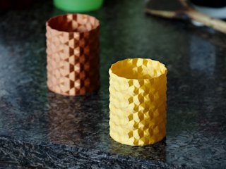
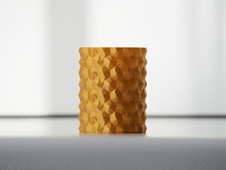
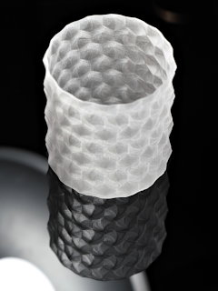
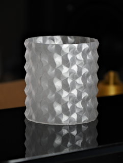

# Hex Twist surface vase (spiral print)
*3D printable vase, pen holder, or general container with hexagonal twisty surface*

### License
[Creative Commons - Attribution](https://creativecommons.org/licenses/by/4.0/)

### Attribution
This is a remix of my own [Hex Surface Vase](https://github.com/DrLex0/print3d-hex-surface-vase).

### Gallery

[🔎](images/photo1.jpg) [🔎](images/photo2.jpg) [🔎](images/photo3.jpg) [🔎](images/photo4.jpg)

## Description and Instructions

This is a variation on my Hex Surface Vase, with an extra twist inside the hexagonal tiles for even more interesting lighting effects, especially when printing this in ‘silky’ or other reflective filaments.

Like the original, this is intended to be printed in ‘spiral vase’ mode which prints a single seamless wall in one continuous movement. The radius of the models is about 53 mm, scale it up or down as you see fit.

You can create a model of any reasonable desired height by taking the tallest one (6) and cutting it down.

### Printing

‘Spiral vase’ mode (as it is called in PrusaSlicer and Slic3r) has different names in different slicing programs: Cura calls it “Spiralize outer contour” (may need to be activated in the preferences), in S3D it is “Corkscrew/vase.” It is not mandatory for printing this model, but provides the nicest results when printing with a single shell.

You can also print it without spiral mode by setting infill to 0% and zero top layers. This allows to print with more shells for extra strength, but it will produce a visible seam unless you enable random contour starting points in your slicer.

For a really smooth finish on smaller prints, print in spiral vase mode with 0.1 mm layers. 0.2 mm is good for larger sizes.

## Updates

### 2023/03/19
First published.

### 2023/03/26
Subdivided the surfaces for smoother prints at large scales.

## TAGS
`faceted`, `hex`, `hexagon`, `honeycomb`, `spiral vase`, `spiral vase printing`, `twist`, `vase`
